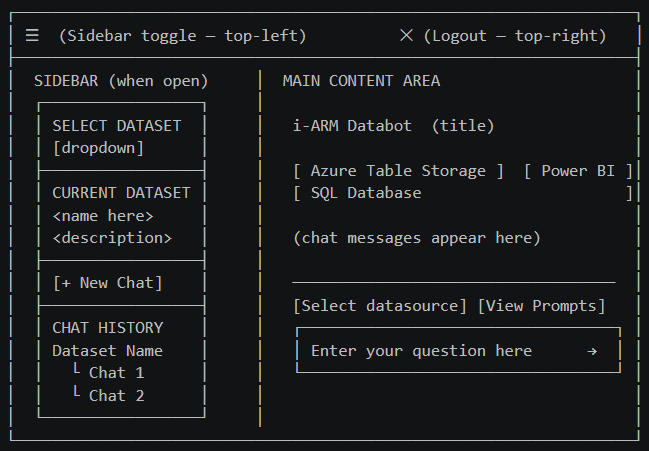

# i-ARM Databot — User Manual


## 1. Overview

**i-ARM Databot** is an enterprise-grade conversational AI assistant developed by **Infotechtion** that enables business users to explore, analyse, and extract insights from their organisation's data simply by asking questions in Natural Language — no SQL knowledge, no technical training, and no reliance on IT for routine data queries.

The current release lets you:

- Ask natural language questions against Microsoft Power BI, Azure SQL Database, and Azure Table Storage datasets
- Receive instant answers as interactive charts, downloadable data tables, and AI-generated narrative summaries
- Browse a curated Prompts Library of ready-made questions for each dataset
- Save, resume, rename, and delete conversations from a persistent Chat History
- Use AI-suggested follow-up questions to explore data layer by layer

All data access is governed by your organisation's existing Microsoft Entra ID permissions.

---

## 2. Who This Is For

| Role | Use Case |
|---|---|
| **Standard Users (Business Analyst / Data Explorer)** | Ask natural language questions, explore datasets, download charts and tables for reporting and analysis |
| **Administrator (IT / Platform Owner)** | Deploy, configure, and maintain the Databot; |


---

## 3. Getting to the Databot

### Signing In for the First Time

1. Open your browser and navigate to the **Databot URL** provided by your administrator.
2. The page automatically redirects to the **Microsoft sign-in page**.
3. Enter your **work email address and password** — the same credentials you use for Microsoft 365 / Outlook.
4. Complete any **multi-factor authentication (MFA)** prompt if required by your organisation.
5. After a successful sign-in, you are redirected back to the Databot automatically.

The main Databot interface loads, showing three data source cards in the centre of the screen and the sidebar toggle (☰) in the top-left corner.

> **Note:** You do not need to create a separate Databot account. Your existing Microsoft work account is used. If you cannot sign in, contact your IT administrator.

### Returning Users

On subsequent visits, if your session is still active, you will be taken directly into the application without needing to sign in again. Your last conversation may also be restored automatically.

### Sign-In Error Screen

If the sign-in process fails three consecutive times, a red **Authentication Error** box is displayed. This screen provides two recovery options:

| Button | What it does |
|---|---|
| **Try Again** | Resets the attempt counter and retries the sign-in flow |
| **Reset & Refresh** | Clears all stored session data and fully reloads the application |

If the error persists after using both buttons, contact your administrator — the backend service may be temporarily unavailable.

---

## 4. The Main Interface

The main interface consists of a sidebar panel, a central chat area, and an input bar at the bottom. The layout is described below:



### Key Controls at a Glance

| Control / Element | Location | Description |
|---|---|---|
| **☰ Sidebar Toggle** | Top-left corner | Opens and closes the left sidebar panel |
| **✕ Logout** | Top-right corner | Signs you out of the application immediately |
| **Data source cards** | Centre of screen (before dataset selected) | Clickable tiles to select your data source type |
| **Select Dataset dropdown** | Sidebar — top | Selects which specific dataset to query |
| **Current Dataset panel** | Sidebar — middle | Shows the active dataset name and its AI-generated description |
| **+ New Chat button** | Sidebar — below Current Dataset | Starts a fresh conversation on the same dataset |
| **Chat History** | Sidebar — bottom | All past conversations grouped by dataset; expandable accordions |
| **Select datasource button** | Input bar — left | Opens a popup to switch data source mid-conversation |
| **View Prompts button** | Input bar — right | Opens the Prompts Library popup for the selected dataset |
| **Question input box** | Bottom centre | Where you type your questions in plain English |
| **Send button (→)** | Inside input box — right | Sends your typed question |
| **Stop button (■)** | Inside input box — right (during a query) | Cancels a query that is currently running |

---

## 5. Querying Your Data

Querying data in the Databot follows a three-step workflow: choose a data source, select a dataset, then ask your question.

### Step 1 — Choose a Data Source

Before asking any questions, select the type of data source you want to query. When no dataset is active, the main area shows three clickable cards:

| Card | Icon | What it connects to |
|---|---|---|
| **Azure Table Storage** | Blue storage icon | Tables in your organisation's Azure Storage account |
| **Power BI** | Yellow Power BI logo | Semantic models published in Power BI workspaces |
| **SQL Database** | Blue database icon | Relational business databases hosted on Azure SQL (full-width card, bottom row) |

Click the card for the data type you want. The sidebar opens and loads the list of available datasets for that source.

**Switching data source mid-session:**

1. Click the **"Select datasource"** button in the input bar.
2. A popup appears showing the available sources in a grid.
3. Click the source you want. The sidebar reloads with the relevant datasets.
4. Switching to a different data source starts a fresh conversation — your current chat is preserved in Chat History.

---

### Step 2 — Select a Dataset

After choosing a data source, select which specific dataset to query.

**Dataset Name**
Click the **"SELECT DATASET"** dropdown in the sidebar and choose from the list. If datasets are still loading, the dropdown shows *"Loading datasets..."* — wait a moment. If none are available, contact your administrator to verify your data source access.

**Dataset Description**
Once a dataset is selected, the **"CURRENT DATASET"** panel updates with the dataset name and an AI-generated description of its contents. Read this description before asking your first question — it tells you what data is available and what questions are worth exploring.

A blue banner also appears in the main area confirming the active dataset: *"Currently using [Dataset Name] from [Source Type]."*

> **Tip:** If you are unsure what to ask, click the **"View Prompts"** button after selecting a dataset to browse ready-made questions tailored to that dataset.

---

### Step 3 — Ask a Question

With a dataset selected, the question input box at the bottom becomes active.

**Typing your question**
Click the input box (it reads *"Enter your question here"*) and type your question in plain English. Examples:

- *"Show me total revenue by department for Q1 2024"*
- *"Which products had the highest return rate last month?"*
- *"Compare sales performance across all regions year to date"*

**Sending the question**
Press **Enter** on your keyboard, or click the blue **send arrow (→)** inside the input box. Use **Shift + Enter** to add a new line without sending.

**While your question is being processed:**
A live status indicator appears below your message, updating in real time through each processing step. The entire process typically takes 15–30 seconds depending on question complexity. You can cancel at any time by clicking the **red Stop button (■)**.

Status messages you may see during processing:

| Status Message | What is happening |
|---|---|
| *Received query. Initialising* | Query received by the backend |
| *Generating DAX / SQL query* | AI is translating your question into a precise database query |
| *Fetching data from Power BI / SQL* | Query is being executed against the data source |
| *Generating chart* | Visualisation is being created from the result |
| *Building response* | Final answer is being assembled |

---

## 6. Working with Results

After your question is processed, the Databot displays its answer. An answer can consist of up to five components, always presented in this order:

### Interactive Charts

An interactive Plotly chart is shown when a visual representation adds value. The Databot automatically selects the most appropriate chart type (bar, line, pie, scatter, area, etc.) for the data returned.

When you hover over a chart, a toolbar appears in the top-right corner:

| Toolbar Icon | Action |
|---|---|
| 📷 Camera | Downloads the chart as a PNG image to your computer |
| 🔍 Zoom In / Out | Zooms into or out of the chart |
| ✛ Pan | Switches to pan mode — click and drag to navigate |
| 🏠 Reset Axes | Returns the view to the original zoom and position |
| 📊 Autoscale | Automatically fits all data into view |
| 📐 Box Select / Lasso | Selects a region of the chart for zooming |
| 📌 Toggle spike lines | Shows or hides crosshair lines on hover |

**Chart interactions:**
- **Hover** over any data point to see an exact value tooltip.
- **Click and drag** on chart axes to zoom into a specific range.
- **Double-click** anywhere on the chart to reset the zoom.
- **Click a legend item** to show or hide a data series.

---

### Data Tables

Tabular results are shown as a scrollable, styled table. Tables load the first **100 rows** by default. A progress indicator below the table shows how many rows are loaded:

> **Showing 100 of 350 rows (28%)** — [Load 100 more rows ↓]

Click **"Load 100 more rows ↓"** to load additional batches. When all rows are loaded, the indicator shows **"All [N] rows loaded ✓"** in green.

| Feature | Description |
|---|---|
| **Column headers** | Top row, grey background — labels for each column |
| **Alternating row colours** | White and light grey alternating rows for easier reading |
| **Horizontal scrolling** | Scroll right to see all columns in wide tables |
| **Download CSV (↓)** | Icon at the top-left of the table — downloads all data as a `.csv` file |

> **Tip:** To get all rows in a spreadsheet, click **Download CSV** rather than loading rows on screen. The CSV always contains the full result set up to the configured maximum of 1,000 rows, and can be opened in Microsoft Excel or Google Sheets. The downloaded file is named `table-output-[timestamp].csv`.

---

### Narrative Description

A plain-English explanation of the result is displayed in a grey panel. For example:

> *"Total sales for Q1 2024 reached £2.4 million, with the North West performing highest at £680,000 — an increase of 12% compared to Q1 2023."*

This narrative is generated by the AI and provides context and key highlights for the data returned.

---

### Query Panel (Advanced)

A collapsible **"▸ Query"** panel appears below the answer. This shows the exact DAX or SQL query that was generated and executed against your data source.

- Click the **"▸ Query"** header bar to expand and view the query in a dark monospace code block.
- Click the header bar again to collapse the panel.

> **Note for non-technical users:** You do not need to read or understand the query. It is provided for transparency so that technical users and administrators can verify the Databot is querying the correct data in the correct way.

---

### Follow-Up Suggestions

After every answer, a blue gradient box titled **"I can also help you explore:"** appears with 2–4 AI-generated follow-up questions based on your current result.

**Using a follow-up suggestion:**

1. Read the suggested questions displayed as clickable pill-shaped chips.
2. Click any chip to instantly submit it as your next question.
3. The Databot processes it exactly like a manually typed question.

**Example:** If you asked *"Show total revenue by region for Q1"*, follow-up suggestions might include:
- *"Which region had the highest growth rate?"*
- *"Break down Q1 revenue by product category"*
- *"Compare Q1 revenue to Q1 last year"*

> **Tip:** Follow-up suggestions are the fastest way to explore your data — they are contextually generated from the current result and dataset.

---

### Answer Feedback

At the bottom of each AI-generated answer, two small icon buttons allow you to rate the response:

| Icon | Meaning | Result |
|---|---|---|
| 👍 Thumbs up | The answer was helpful and accurate | Button highlights green |
| 👎 Thumbs down | The answer was unhelpful or incorrect | Button highlights red |

After clicking either button, a small message confirms: **"Thanks for your feedback!"**

- Click the same button again to **clear** your rating.
- Click the opposite button to **switch** from positive to negative, or vice versa.

> **Note:** Feedback is recorded to help the team improve the Databot over time. There is no free-text comment field in Version 1.0.

---

## 7. The Prompts Library

The **Prompts Library** is a curated set of AI-recommended, ready-made questions for each dataset — an ideal starting point if you are new to a dataset or want to run standardised reporting queries.

### Opening the Prompts Library

1. Ensure a dataset is selected — the **"View Prompts"** button is greyed out until a dataset is chosen.
2. Click the **"View Prompts"** button in the input bar area (above the text input, on the right).
3. A popup panel appears with recommended prompts displayed in a 2-column grid.

### Prompt Cards

Each prompt card shows:
- A coloured icon on the left indicating the prompt category
- The **question text** that will be submitted when clicked

### Using a Prompt

1. Click any prompt card in the popup.
2. The popup closes automatically.
3. The prompt text is placed in the input box and submitted immediately.
4. The Databot begins processing the question.

---

## 8. Managing Chat History

Every conversation is saved automatically and listed in the sidebar under **"Chat History"**. No manual save action is required.

### Opening the Sidebar

Click the **☰ toggle button** in the top-left corner to open the sidebar.

### How Chat History is Organised

Chat history is grouped by **dataset name**. Each dataset group is a collapsible accordion section:

```
▼ Sales Performance Dataset
    >  Revenue breakdown by region      14/04/2026  09:15
    >  Top 10 products this month       13/04/2026  16:30
▶ HR Analytics Dataset
▶ Finance Overview
```

### Expanding and Collapsing Groups

Click the **dataset name row** (with the chevron ▶/▼ arrow) to expand or collapse that group.

### Loading a Past Conversation

1. Expand the dataset group containing the conversation.
2. Click the conversation title or the message icon.
3. The main area loads all messages from that conversation.
4. The active dataset is automatically set to match the dataset used in that conversation.
5. The currently active chat is highlighted in **blue**.

### Renaming a Conversation

1. Hover over the conversation you want to rename.
2. Click the **pencil icon (✏)** that appears on the right side of the row.
3. The title becomes an editable text field with the current name highlighted.
4. Type the new name.
5. Press **Enter** or click the **green ✓ checkmark** to save, or press **Escape** or click the **red ✕** to cancel.

> **Tip:** Use descriptive names when renaming conversations (e.g. *"Q1 2024 Regional Revenue Analysis"*) so you can find them easily later.

### Deleting a Conversation

1. Hover over the conversation you want to delete.
2. Click the **bin / trash icon (🗑)** that appears on the right side.
3. The conversation is permanently deleted from both the sidebar and the database.
4. If the deleted conversation was currently open, the main area resets to a blank state.

> **[!] Deletion is permanent and cannot be undone.** There is no confirmation prompt — take care when clicking the delete icon.

### Auto-Generated Conversation Titles

A conversation's title is automatically generated from your first question. For example, if your first question was *"Show total sales by region"*, the title will be something like *"Total Sales Analysis by Region"*. You can rename any conversation at any time using the pencil icon.

---

## 9. Starting a New Conversation

You can start a fresh conversation at any time without losing your existing history.

**Method 1 — The "+ New Chat" button**

1. Open the sidebar (click ☰ if closed).
2. Click the **"+ New Chat"** button (blue button between the Current Dataset panel and Chat History).
3. A new, empty conversation begins on the same currently selected dataset.

> The **"+ New Chat"** button is only visible when a dataset is active.

**Method 2 — Selecting a different dataset**

Choosing a different dataset from the **"SELECT DATASET"** dropdown while in a conversation automatically creates a new conversation for the new dataset. Your previous conversation is preserved in Chat History.

**Method 3 — Switching data source**

Clicking a different data source (from the **"Select datasource"** button or the home screen cards) clears the current conversation area and lets you start fresh with a new dataset.

---

## 10. Stopping a Running Query

If a query is taking too long, or you realise you asked the wrong question, you can cancel it at any time.

**How to stop a query:**

1. While a query is running, the **send button (→)** changes to a **red filled square (■)**.
2. Click the **red ■ Stop button**.
3. The query is immediately cancelled.
4. The status indicator disappears.
5. The input box returns to its active state so you can type a new question.

> **Note:** If the query was nearly complete when you clicked Stop, the response may have already been generated on the server. In this case, the result is discarded and will not appear on screen.

---

## 11. Signing Out

To sign out of the Databot:

1. Click the **red Logout icon (✕ / door-with-arrow)** in the **top-right corner** of the screen.
2. You are signed out immediately.
3. The page returns to the sign-in state.

> **Note:** After signing out, simply close the browser tab or navigate away. If you return to the Databot URL, you will be prompted to sign in again.

---

## 12. Statuses and States

### Input Box States

| Status | Appearance | When it occurs | User action |
|---|---|---|---|
| **Active** | White background, ready to type | Dataset selected, no query running | Type and send your question |
| **Disabled** | Grey background, cannot type | No dataset selected, or query in progress | Select a dataset or wait for the current query to finish |
| **Setting up** | Shows *"Setting up chat session..."* | New conversation is being initialised | Wait — the input becomes active automatically (typically 2–5 seconds) |
| **No dataset** | Shows *"Please select a dataset first"* | No dataset has been chosen | Open the sidebar (☰) and select a dataset from the dropdown |

---

## 13. Limits and Guidelines

| Limit | Value | Notes |
|---|---|---|
| **Table rows displayed by default** | 100 rows | Additional rows are loaded in batches of 100 by clicking "Load more" |
| **Maximum CSV export rows** | 1,000 rows | The downloaded CSV contains up to 1,000 rows regardless of how many are loaded on screen |
| **Maximum OAuth sign-in attempts** | 3 attempts | After 3 consecutive failures, an Authentication Error screen is shown; use "Reset & Refresh" to clear and retry |
| **Maximum request size** | ~1 MB | Very long conversations may exceed this limit; start a new chat when you see a "request too large" error |
| **Query processing timeout** | ~120 seconds | Queries exceeding the timeout will fail; try simplifying or rephrasing the question |
| **Simultaneous active queries** | 1 per user session | You cannot submit a new question while one is already running; use the Stop button first |
| **Conversation auto-save** | Continuous | All messages are saved automatically — no manual save action is needed |
| **Data source access** | Governed by existing permissions | The Databot does not grant additional data access beyond what you already hold in Power BI, Azure SQL, or Azure Storage |

---

## 14. Tips and Best Practices

### Writing Effective Questions

**Be specific** — Include time ranges, filters, and metrics:
> *"Show me monthly revenue for the UK region from January to March 2024"*

**Name the fields you care about** — If you know column names, use them:
> *"Break down the Headcount column by Department and Location"*

**Ask for the format you want** — Specify charts or tables:
> *"Give me a bar chart of the top 10 products by sales volume this year"*

**Avoid vague questions** — These produce less accurate results:
> *"Show me the data"* or *"What happened last year?"*

**Use follow-up questions** — Build on previous answers:
> First: *"Show me revenue by region"*
> Then: *"Drill down into the Northern region by product category"*

---

### Managing Conversations

- Keep each conversation **focused on one topic** — this helps the AI maintain context and produce more accurate follow-up answers.
- Start a **New Chat** when you switch topics or datasets.
- Use **descriptive names** when renaming conversations so you can find them easily in Chat History.
- If you are seeing *"Request too large"* errors, start a new chat — very long single conversations can exceed the API size limit.

---

### Downloading Results

- Use **Download CSV** from data tables when you need to work with data in Microsoft Excel or another tool.
- Use the **chart camera icon** to save charts as PNG images for presentations or reports.

---

### Performance

- **Simpler, more specific questions** get faster responses — broad or complex queries involving many filters and aggregations take longer.
- If a query appears stuck for more than 60 seconds, click the **red Stop button (■)** and try rephrasing or simplifying.
- If the **WebSocket status connection** drops ("Waiting for status connection..."), wait a few seconds — it typically recovers automatically and the query will still complete.

---

### Privacy and Data Handling

- All questions you ask are processed by an AI model hosted within your organisation's Azure subscription.
- Chat history is saved to an Azure SQL database within your organisation's environment.
- The Databot does not share your data with any external parties.

---

## 15. Error Messages and Troubleshooting

| Error / Message | Cause | Resolution |
|---|---|---|
| **"Failed to authenticate after 3 attempts"** | The backend login service was unreachable during sign-in | Click **"Reset & Refresh"** and try again; contact your administrator if the issue persists |
| **"OAuth Error: access_denied"** | You cancelled or denied the Microsoft sign-in prompt | Click **"Try Again"** and complete the sign-in |
| **"Backend URL not configured"** | Deployment misconfiguration | Contact your administrator |
| **"Please select a dataset first"** | Input box is active but no dataset has been chosen | Open the sidebar (☰) and select a dataset from the dropdown |
| **"No Power BI datasets available"** (or similar) | Your account has no accessible datasets in the selected source, or the connection is misconfigured | Contact your administrator to verify your access and connection settings |
| **"Setting up chat session..."** (persists) | New session initialisation is slow or has failed | Wait 5–10 seconds; if it persists, refresh the page |
| **"Waiting for status connection..."** | The live WebSocket status channel is temporarily unavailable | Wait a few seconds — it resolves automatically; your query will still be processed |
| **413 / "Your request was too large"** | The conversation is too long for a single API request | Click **"+ New Chat"** in the sidebar to start a fresh conversation on the same dataset |
| **"Error rendering message"** | A technical error occurred while displaying the AI response | Refresh the page and retry your question; report to your administrator if it recurs |
| **Chart does not appear** | The query returned data that could not be visualised (e.g. a single scalar value or incompatible data types) | The result will still be shown as a table or narrative description; rephrase to request a breakdown or different format |
| **Session lost after page refresh** | Browser storage restrictions or private browsing mode prevent session persistence | Select your dataset again from the sidebar and use Chat History to navigate back to your previous conversation |

---

## 16. Glossary

- **Dataset** — A specific collection of data within a data source (e.g. a Power BI semantic model, an Azure SQL database, or an Azure Storage table) that the Databot can query.
- **Data Source** — The platform hosting your data. The Databot currently supports three: Microsoft Power BI, Azure SQL Database, and Azure Table Storage.
- **DAX (Data Analysis Expressions)** — The query language used by Microsoft Power BI. The Databot generates DAX automatically from your natural language question.
- **SQL (Structured Query Language)** — The query language used by relational databases. The Databot generates SQL automatically for Azure SQL Database queries.
- **Prompts Library** — A curated set of ready-made questions configured per dataset, accessible via the "View Prompts" button.
- **Follow-Up Suggestions** — AI-generated question recommendations shown after each answer, based on the current result and dataset context.
- **Chat History** — A persistent record of all your past conversations, stored securely in Azure SQL and accessible from the sidebar.
- **Microsoft Entra ID (formerly Azure Active Directory)** — Microsoft's identity platform, used for single sign-on (SSO) authentication into the Databot.
- **MFA (Multi-Factor Authentication)** — A security step requiring a second form of verification (e.g. an authenticator app) in addition to your password.
- **UAMI (User-Assigned Managed Identity)** — An Azure security credential used by the backend service to access data sources without storing passwords.
- **WebSocket** — A persistent communication channel used by the Databot to stream live query status updates to your browser in real time.
- **Semantic Model** — A Power BI dataset that includes business-friendly naming, relationships, and measures built on top of raw data.

---

*Last updated: April 2026 — Version 1.0.0* |
