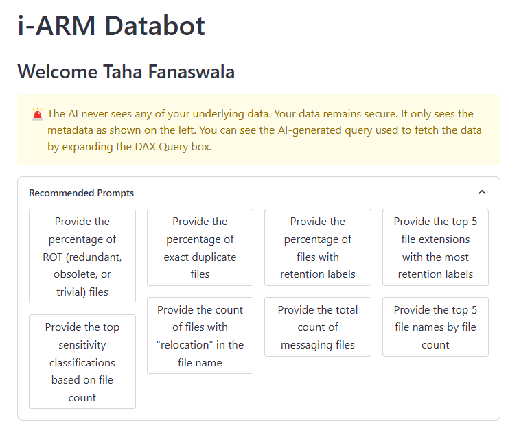
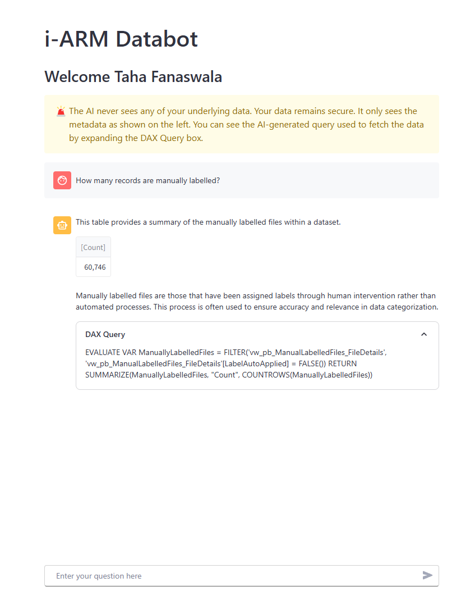

# User Guide for i-ARM Databot

Welcome to the i-ARM Databot! This guide will walk you through how to use the Databot, enabling you to understand your enterprise content. Whether you're tracking compliance, auditing records, or generating reports, this Databot is designed to enhance your records management capabilities.

---
## 1. Getting Started

To begin using the i-ARM Databot, login to your tenant's i-ARM, and select Databot in the top navigation bar.

---

## 2. Connecting to Power BI Datasets

### Step 1: Accessing the Dataset
Once you open the Databot, it will automatically connect to the available Power BI records management datasets. The Databot will list all available datasets, and you can choose the one you wish to interact with.

### Step 2: Selecting the Dataset
Once the Databot presents the list of datasets, you can select the one that contains the records you need, and begin or continue your conversation

---

## 3. Interacting with the Databot

### Asking Questions
The Databot can respond to a variety of questions about the records in your Power BI dataset. Here are a few examples to try out with the Data Explorer report:

- `"How many records are in the dataset?"`
- `"What are my most commonly applied record labels?"`
- `"What are the top sensitivity classifications?"`

Some datasets will have pre-configured prompts for you to select from, as seen below:

You can also view the DAX query the Databot created to gather the data, providing full transparency in how the Databot is arriving at its answers.

You can also ask the Databot general questions abouts records management, such as useful terms, best practices, etc. 

---

## 4. Troubleshooting

### Common Issues

- **Issue: Unexpectedly not allowed to converse with the dataset**  
  **Solution:** Check if the dataset has row-level security enabled, and that you are granted access. Please reach out to your tenant's Power BI admin for further assistance.

- **Issue: Received data in tabular format instead of a chart**  
  **Solution:** Prompt the Databot to give you the results in the desired format. You can converse with the Databot just like any other chatbot.

---

## 5. FAQ

### Q: How frequently are the datasets updated?
A: Datasets are updated automatically based on the schedule your tenant's Power BI Admin has set up.

---

## 6. Contact Support

If you encounter issues or have additional questions, you can reach our support team:

**Support Email:** support@infotechtion.com  

---

We hope this guide helps you navigate the i-ARM Databot. Enjoy your experience managing and analyzing records!
